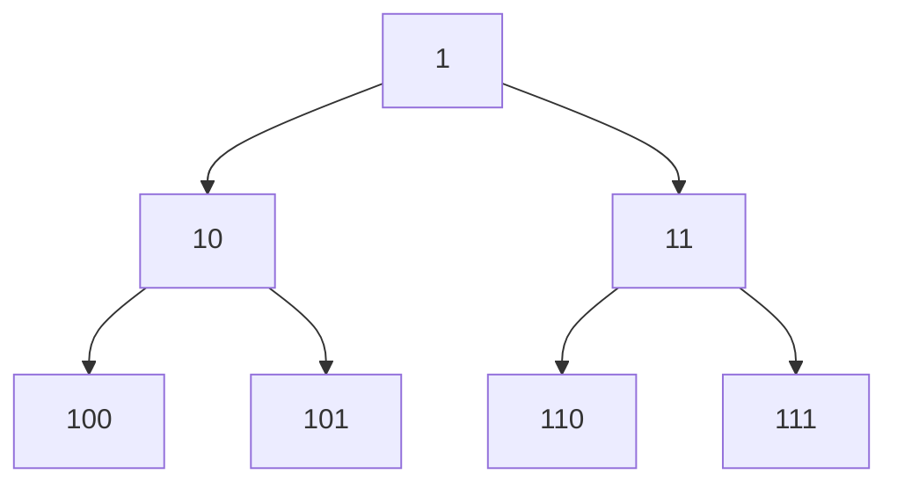

# 1261. 在受污染的二叉树中查找元素

> [1261. 在受污染的二叉树中查找元素](https://leetcode.cn/problems/find-elements-in-a-contaminated-binary-tree/)
>
> 难度：<font color=orange>`Medium`</font>
>
> 标签：`树` `深度优先搜索` `广度优先搜索` `设计` `哈希表` `二叉树`

## 题目

<p>给出一个满足下述规则的二叉树：</p>

<ol>
	<li><code>root.val == 0</code></li>
	<li>如果 <code>treeNode.val == x</code> 且&nbsp;<code>treeNode.left != null</code>，那么&nbsp;<code>treeNode.left.val == 2 * x + 1</code></li>
	<li>如果 <code>treeNode.val == x</code> 且 <code>treeNode.right != null</code>，那么&nbsp;<code>treeNode.right.val == 2 * x + 2</code></li>
</ol>

<p>现在这个二叉树受到「污染」，所有的&nbsp;<code>treeNode.val</code>&nbsp;都变成了&nbsp;<code>-1</code>。</p>

<p>请你先还原二叉树，然后实现&nbsp;<code>FindElements</code>&nbsp;类：</p>

<ul>
	<li><code>FindElements(TreeNode* root)</code>&nbsp;用受污染的二叉树初始化对象，你需要先把它还原。</li>
	<li><code>bool find(int target)</code>&nbsp;判断目标值&nbsp;<code>target</code>&nbsp;是否存在于还原后的二叉树中并返回结果。</li>
</ul>

<p>&nbsp;</p>

<p><strong>示例 1：</strong></p>

<p><strong></strong></p>

<pre><strong>输入：</strong>
[&quot;FindElements&quot;,&quot;find&quot;,&quot;find&quot;]
[[[-1,null,-1]],[1],[2]]
<strong>输出：</strong>
[null,false,true]
<strong>解释：</strong>
FindElements findElements = new FindElements([-1,null,-1]); 
findElements.find(1); // return False 
findElements.find(2); // return True </pre>

<p><strong>示例 2：</strong></p>

<p><strong></strong></p>

<pre><strong>输入：</strong>
[&quot;FindElements&quot;,&quot;find&quot;,&quot;find&quot;,&quot;find&quot;]
[[[-1,-1,-1,-1,-1]],[1],[3],[5]]
<strong>输出：</strong>
[null,true,true,false]
<strong>解释：</strong>
FindElements findElements = new FindElements([-1,-1,-1,-1,-1]);
findElements.find(1); // return True
findElements.find(3); // return True
findElements.find(5); // return False</pre>

<p><strong>示例 3：</strong></p>

<p><strong></strong></p>

<pre><strong>输入：</strong>
[&quot;FindElements&quot;,&quot;find&quot;,&quot;find&quot;,&quot;find&quot;,&quot;find&quot;]
[[[-1,null,-1,-1,null,-1]],[2],[3],[4],[5]]
<strong>输出：</strong>
[null,true,false,false,true]
<strong>解释：</strong>
FindElements findElements = new FindElements([-1,null,-1,-1,null,-1]);
findElements.find(2); // return True
findElements.find(3); // return False
findElements.find(4); // return False
findElements.find(5); // return True
</pre>

<p>&nbsp;</p>

<p><strong>提示：</strong></p>

<ul>
	<li><code>TreeNode.val == -1</code></li>
	<li>二叉树的高度不超过&nbsp;<code>20</code></li>
	<li>节点的总数在&nbsp;<code>[1,&nbsp;10^4]</code>&nbsp;之间</li>
	<li>调用&nbsp;<code>find()</code>&nbsp;的总次数在&nbsp;<code>[1,&nbsp;10^4]</code>&nbsp;之间</li>
	<li><code>0 &lt;= target &lt;= 10^6</code></li>
</ul>


--------------------

## 题解

### 方法一

**思路**

通过 dfs 还原树，然后查找时，通过 target 计算出目标值所在的那一层节点的范围，与中值做比较，如果大于中值则向右子树，否则向左子树查找，在查找的过程中范围需要同时缩小一半，如果查找的树为空或者超出了范围说明找不到（类似于二分查找）。

> 一开始还原了树，可以不还原，在当前查找的过程中同时计算。

**代码**

```java
class FindElements {
    private TreeNode root;

    public FindElements(TreeNode root) {
        // dfs(root, 0);
        this.root = root;
    }

    private void dfs(TreeNode root, int val) {
        if (root == null) return;
        root.val = val;
        dfs(root.left, 2 * val + 1); 
        dfs(root.right, 2 * val + 2); 
    }
    
    public boolean find(int target) {
        int n = (int) (Math.log(target + 1) / Math.log(2));
        int min = (int) Math.pow(2, n) - 1;
        int max = min + (int) Math.pow(2, n) - 1;
        TreeNode cur = this.root;
        int val = 0;
        while (cur != null && min <= max) {
            if (val == target) return true;
            int mid = (min + max) >> 1;
            if (target <= mid) {
                cur = cur.left;
                max = mid;
                val = 2 * val + 1; 
            } else {
                cur = cur.right;
                min = mid + 1;
                val = 2 * val + 2; 
            }
        }
        return false;
    }
}
```

**复杂度分析**

> 以下为初始化时不还原树的复杂度分析

- 时间复杂度：初始化为 $O(1)$，find 为 $O(min(h,\log target))$。h 为树的高度。
- 空间复杂度：$O(1)$​​。


> 下面的方法参考：https://leetcode.cn/problems/find-elements-in-a-contaminated-binary-tree/solutions/2681672/liang-chong-fang-fa-ha-xi-biao-wei-yun-s-6m7w

### 方法二：哈希表

> 一开始也没想到可以用哈希表。

初始化时用哈希表记录树中的数值。这样，初始化时间复杂度为 $O(n)$，find 时间复杂度为 $O(1)$，空间复杂度为 $O(n)$。

### 方法三：位运算

**思路**

如果把树中的值 + 1，很容易发现二进制的表示可以代表值在树中的路径。除去第一位，从左往右的二进制表示了在树中的路径，为 0 向左子树走，为 1 往右子树走。



**代码**

```java
class FindElements {
    private TreeNode root;

    public FindElements(TreeNode root) {
        this.root = root;
    }

    public boolean find(int target) {
        target++;
        TreeNode cur = root; // 从根节点出发
        for (int i = 30 - Integer.numberOfLeadingZeros(target); i >= 0; i--) { // 从次高位开始枚举
            int bit = (target >> i) & 1; // target 第 i 位的比特值
            cur = bit == 0 ? cur.left : cur.right;
            if (cur == null) { // 走到空节点，说明 target 不在二叉树中
                return false;
            }
        }
        return true; // 没有走到空节点，说明 target 在二叉树中
    }
}
```

**复杂度分析**

- 时间复杂度：初始化为 $O(1)$，find 为 $O(min(h,\log target))$。h 为树的高度。
- 空间复杂度：$O(1)$​​。
